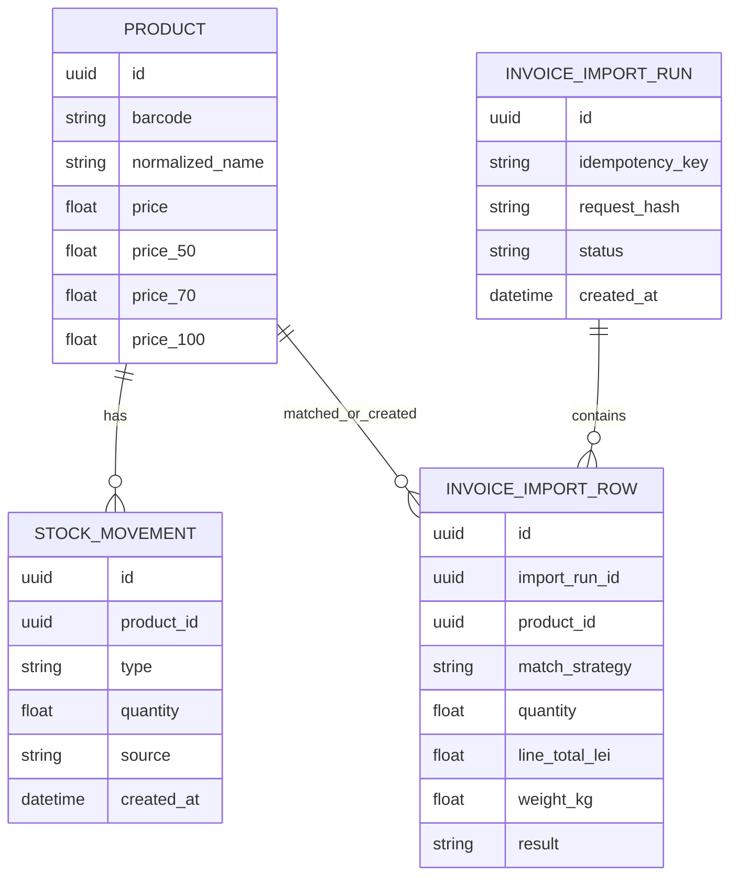

# feat: Backend Invoice Import Pricing Parity (MVP - Simple Mode)

## Overview

Implement invoice import pricing parity in this FastAPI service with a minimal API scope.

This plan intentionally excludes frontend implementation tasks. The React app is a client of this backend and performs final DB writes.

## Delivery Strategy (MVP First)

### V1 (working first, MVP simple mode)
- Extend `POST /extract` with optional `row_id` and `weight_kg_candidate`.
- Add `POST /invoice/preview-pricing` with row status: `ok` or `needs_input`.
- Frontend performs create/update + stock movement writes through existing app API layer.
- Keep error model minimal: `INVALID_PAYLOAD`, `MISSING_WEIGHT`, `INTERNAL_ERROR`.

### V2 (hardening and richer contract)
- Add richer parse metadata (`size_token`, `parse_confidence`).
- Add expanded error taxonomy and stricter HTTP semantics.
- Add ambiguity-safe matching feedback and richer warnings.
- Add deeper observability and operational guardrails.

## Problem Statement / Motivation

Current backend capabilities are extraction-only:
- `POST /extract` exists in `src/invproc/api.py`.
- No pricing preview endpoint.
- No import endpoint.
- No persistence adapter for product updates/creates/stock movements.

Business requirement is to stop manual Excel calculations while preserving trusted margin outputs and supporting manual weight overrides from the frontend.

## Local Research Summary

### Internal References
- Current API surface: `src/invproc/api.py:117`
- Current invoice data models: `src/invproc/models.py:7`
- Config and startup validation: `src/invproc/config.py:13`
- Existing API tests pattern: `tests/test_api.py:1`

### Institutional Learnings Applied
- Avoid model-layer coupling to config: `docs/solutions/architecture-issues/pydantic-model-layer-violation.md`
- Keep blocking work off event loop with `run_in_threadpool`: `docs/solutions/performance-issues/blocking-io-async-prevents-concurrency.md`
- Avoid mutable global shared state for request flows: `docs/solutions/runtime-errors/global-state-thread-safety-race-conditions.md`
- Validate config early and fail fast: `docs/solutions/configuration-issues/startup-config-validation.md`

### External Research Decision
Skipped. This feature is constrained by explicit business formulas and existing local architecture decisions.

## SpecFlow Analysis (Backend)

### Primary Flow A: Extract -> preview pricing -> frontend write
1. Frontend sends PDF to `POST /extract`.
2. Backend returns extracted rows with parsed `weight_kg_candidate` per row.
3. Frontend applies user edits and sends rows to `POST /invoice/preview-pricing`.
4. Backend computes canonical pricing for each row.
5. Frontend confirms and persists rows using existing app API layer.

### Primary Flow B: Missing weight
1. Extracted row has no parseable weight.
2. Frontend supplies manual `weight_kg` in preview payload.
3. Backend rejects import rows with missing/invalid weight.

### Edge Cases
- `quantity <= 0`
- negative line total
- non-numeric values in edited fields
- duplicate submit/retry of same import request
- ambiguous normalized-name match
- comma-decimal parsing (`0,5L`, `200,0G`)

## Proposed Backend Solution

### API Contract Additions
1. Extend `POST /extract` response with row metadata:
- `weight_kg_candidate`
- `weight_parse_source` (`g`, `kg`, `ml`, `l`, `none`)

2. Add `POST /invoice/preview-pricing`:
- Input: normalized invoice rows + optional manual `weight_kg` override.
- Output: per-row `base`, `transport`, `price50`, `price70`, `price100`, warnings/errors.

3. No backend import write endpoint in MVP simple mode:
- Persistence happens in frontend via existing app API layer.

### Pricing Rules (Canonical)
- `base = (line_total_lei / quantity) / 19.5`
- `transport = weight_kg * 1.5`
- `price50 = (base + transport) * 1.5`
- `price70 = (base + transport) * 1.7`
- `price100 = (base + transport) * 2.0`

### Weight Parsing Rules
- Parse units anywhere in product name (not just prefix).
- Supported units: `G`, `KG`, `ML`, `L`.
- Support dot and comma decimals.
- Liquid assumption (temporary): `1L = 1kg`, `1000ml = 1kg`.

### Persistence and Idempotency
- Backend persistence/import endpoint is deferred to v2.
- Frontend write path is source of truth in MVP mode.

## Technical Approach

### Architecture
- Keep Pydantic models pure data models.
- Put pricing and parsing logic in dedicated service modules.
- Keep API handlers orchestration-only.
- Use dependency injection for repositories and services.

### Proposed Modules / Files
- `src/invproc/models.py` (extend request/response models)
- `src/invproc/weight_parser.py` (new)
- `src/invproc/pricing.py` (new)
- `src/invproc/import_service.py` (new)
- `src/invproc/repositories/base.py` (new)
- `src/invproc/repositories/<adapter>.py` (new)
- `src/invproc/api.py` (new endpoints + wiring)
- `src/invproc/config.py` (new feature flags/constants)
- `tests/test_invoice_weight_parser.py` (new)
- `tests/test_invoice_pricing.py` (new)
- `tests/test_invoice_import_api.py` (new)
- `tests/test_invoice_import_idempotency.py` (new)

### ERD (Conceptual for Import Execution)

## Implementation Phases

### Phase 1: Domain primitives and validation
- Add pricing constants in `src/invproc/config.py` with defaults:
  - `FX_RATE=19.5`
  - `TRANSPORT_RATE_PER_KG=1.5`
- Add row-level models for preview/import payloads in `src/invproc/models.py`.
- Add strict numeric validation (reject NaN/inf/negative where invalid).

### Phase 2: Weight parser + pricing services
- Implement unit parser in `src/invproc/weight_parser.py`.
- Implement formula service in `src/invproc/pricing.py`.
- Add deterministic unit tests for comma/dot decimals and all supported units.

### Phase 3: Repository abstraction and import orchestration
- Define repository interface in `src/invproc/repositories/base.py`.
- Implement concrete adapter in `src/invproc/repositories/<adapter>.py`.
- Implement orchestration in `src/invproc/import_service.py`:
  - barcode-first lookup
  - normalized-name fallback (invoice source only)
  - update existing product prices + stock movement
  - create new product + stock movement
  - idempotency checks and replay

### Phase 4: API endpoints
- Extend `POST /extract` in `src/invproc/api.py` to include `weight_kg_candidate`.
- Add `POST /invoice/preview-pricing` in `src/invproc/api.py`.
- Add `POST /invoice/import` in `src/invproc/api.py`.
- Keep blocking adapter calls out of event loop.

### Phase 5: Test and hardening
- Add API contract tests for preview/import endpoints.
- Add error-path tests (missing weight, invalid numeric fields, duplicate idempotency key mismatch).
- Run quality checks:
  - `pytest tests/ -v`
  - `ruff check src/ tests/`
  - `mypy src/`

## Acceptance Criteria

### Functional Requirements
- [x] `POST /extract` returns `weight_kg_candidate` when parseable.
- [x] `POST /invoice/preview-pricing` returns formula-parity price fields.
- [x] Backend scope is only `/extract` and `/invoice/preview-pricing`.
- [x] Frontend write path handles create/update + stock movement.
- [x] Preview rejects rows with missing/invalid `weight_kg`.

### Non-Functional Requirements
- [ ] Endpoint handlers keep request-safe state (no mutable global request context).
- [x] Blocking persistence calls are handled safely in async endpoints.
- [x] API errors are explicit and row-level where possible.

### Formula Parity Requirements
- [x] `base = (lineTotalLei / quantity) / 19.5`
- [x] `transport = weightKg * 1.5`
- [x] `price50 = (base + transport) * 1.5`
- [x] `price70 = (base + transport) * 1.7`
- [x] `price100 = (base + transport) * 2.0`

### MVP Delivery Requirements
- [ ] V1 endpoints are functional end-to-end with the React client.
- [ ] Frontend write path can complete import without Excel-side pricing.
- [ ] Contract stays intentionally minimal; V2 items are deferred.

## Success Metrics
- Invoice imports no longer require manual Excel calculation.
- New and existing product invoice rows get 50/70/100 prices in one pass.
- No duplicate writes on retried imports with same idempotency key.
- No NaN/invalid numeric values persisted from invoice import payloads.

## Dependencies & Risks

### Dependencies
- Persistent data adapter choice and credentials (for products/stock movements/idempotency records).
- Existing product schema compatibility for price fields.

### Risks
- Ambiguous normalized-name matching can update wrong product.
- Migration risk from extraction-only service to write-capable backend.
- Liquid density assumption may drift from true costs.

### Mitigations
- Restrict name fallback to invoice source; log match strategy per row.
- Keep pricing math centralized in one backend module.
- Document liquid assumption in API docs and response warnings.

## Out of Scope
- Frontend invoice dialog and translation updates.
- Dynamic/live FX rate.
- Product-specific liquid density tables.
- XLSX import contract changes.

## Execution Checklist

### V1 Checklist (implement now)
- [x] `src/invproc/models.py` add minimal preview/import request-response models.
- [x] `src/invproc/config.py` add pricing constants and validation.
- [x] `src/invproc/weight_parser.py` implement parser for `G/KG/ML/L` with comma/dot decimals.
- [x] `src/invproc/pricing.py` implement formula parity and rounding policy.
- [x] `src/invproc/api.py` extend `/extract` and add `/invoice/preview-pricing`.
- [x] frontend integration uses existing app API layer for writes.
- [x] `tests/test_invoice_pricing.py` cover formula parity.
- [x] `tests/test_invoice_import_api.py` cover preview/import happy path + missing weight.
- [x] `tests/test_invoice_import_idempotency.py` cover duplicate replay + conflict.

### V2 Checklist (defer)
- [x] Add `size_token` and `parse_confidence` to extract response.
- [x] Add richer row-level warnings and expanded error code set.
- [ ] Add backend `/invoice/import` + idempotency persistence (deferred).
